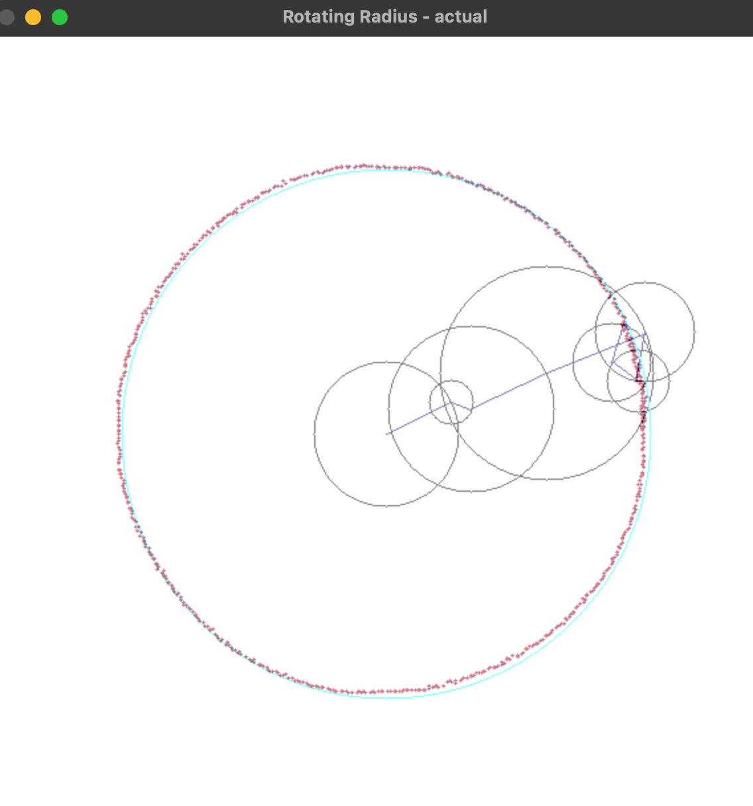
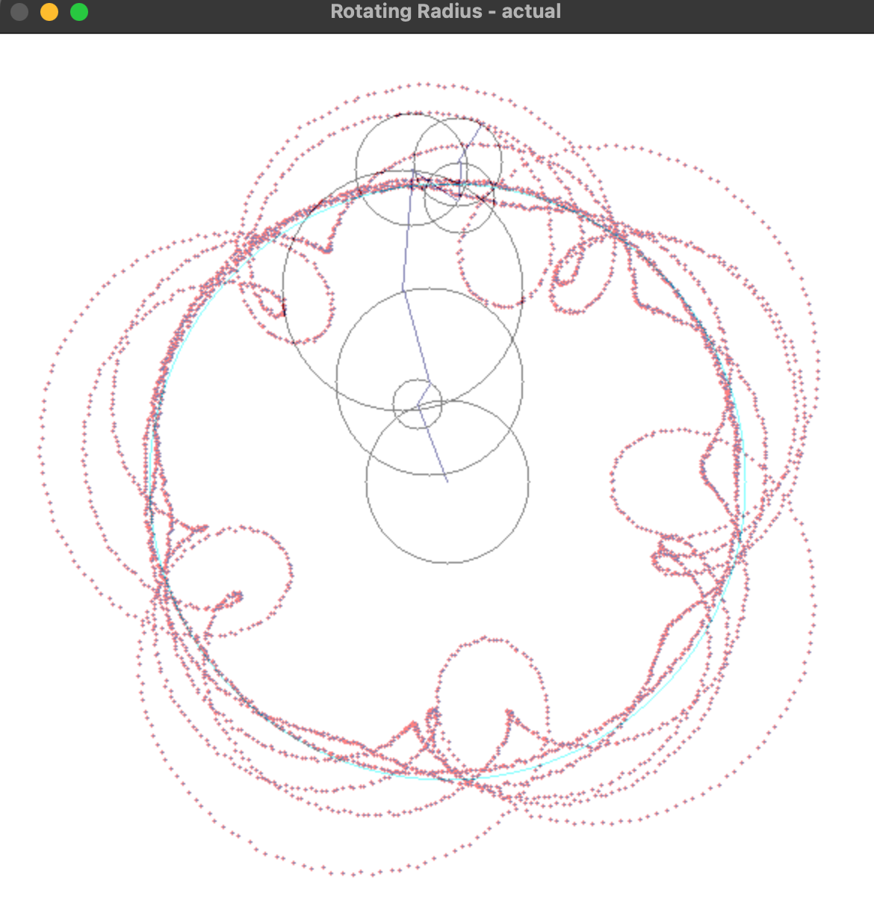
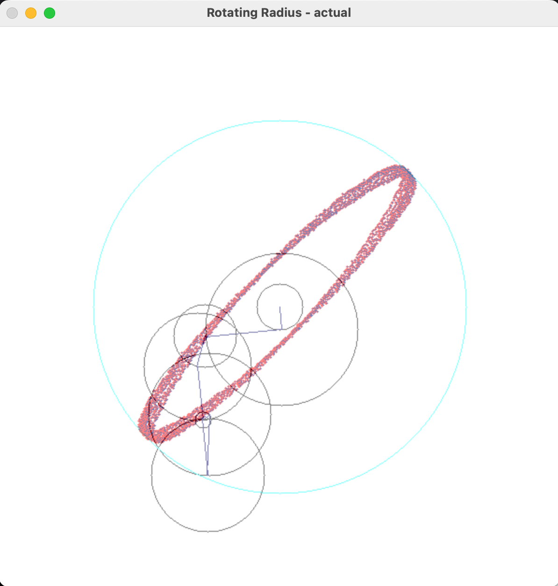

# Fouriers-AI

This project explores a novel approach to fitting and learning periodic trajectories, such as circles or other parametric curves, using concepts inspired by classical PID (Proportional-Integral-Derivative) control. Traditional curve-fitting methods often struggle with stability and long-term divergence, particularly when optimizing multi-rotation trajectories.

We introduce a differentiable, PD-inspired loss function that combines:

Proportional (P) term: measures instantaneous Euclidean distance between predicted and target points.

Derivative (D) term: captures the rate of change of error along the curve, promoting smoothness and reducing overshoot.

Optional Integral (I) term: initially explored to accumulate past error, though removed to improve long-term stability.

This project also explores other forms of error and their affects on Fourier Series based approximations. 

The PID error method given less than 50,000 epochs was capable of finding a set of values for each circle that could near perfectly fit an input circle of size 200 for nearly two full rotations. For more than 2 rotations, the graph begins to diverge from the path assigned to it. This issue most likely arises from the training itself and not from the error function. This is the fundamental issue with training on a finite amount of rotations. Other kinds of error functions yielded the circle but without actually tracing the pattern out as intended. 

The following is a visual representation with the PD style error function after between 0-2 rotations:

After two full rotations, we begin to diverge from the pattern:

Other loss functions such as the traditional MSE result in patterns that do not follow the inital curve like so:

As this pattern continues, the model can essentially hit every point it is required to hit on the circle but does not do so by following the path. Instead, it created its own elliptical pattern and is able to hit every point on the circle when pairing this pattern with a slight offset between each ellipse drawn. 

# How does the proposed PD-inspired loss function solve this?

The derivative term in the PD model adds an extra layer of sensativity to the error, meaning the model will both minimize the overall error measured by the euclidian distance between a predicted and target point as well as minimizing the rate of change of error between any consecutive pair of points. In doing so, we solve the issue of major deviations from the initial path we intend to follow and reduce the possibility of achieving a solution that reaches all points in an unoptimal manner (where the optimal solution is defined by the model perfectly following the path for k rotations). 

# Things to consider

In this project, the enviornment in which this testing occurs is built using OpenCV. This means that the radii of every circle in the model must be an integer value > 0. It is possible that a perfectly optimal solution can only exist if the radii of each circle exist as a real value between two integers. Since OpenCV cannot represent this visually, a more optimal solution may not be possible. 

The outcome demonstrates a novel methodology for stable, differentiable trajectory fitting, leveraging control theory principles in a machine learning context. This framework is applicable to any periodic or parametric trajectory learning task, potentially extending to robotics, animation, and other domains requiring precise motion replication.
